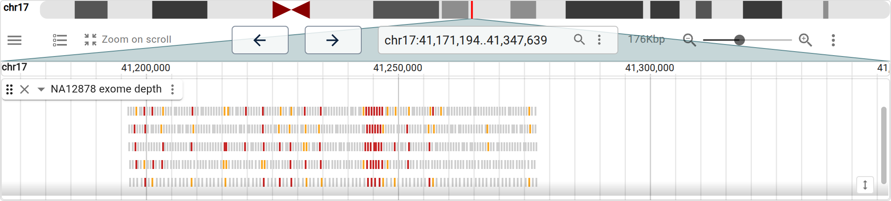
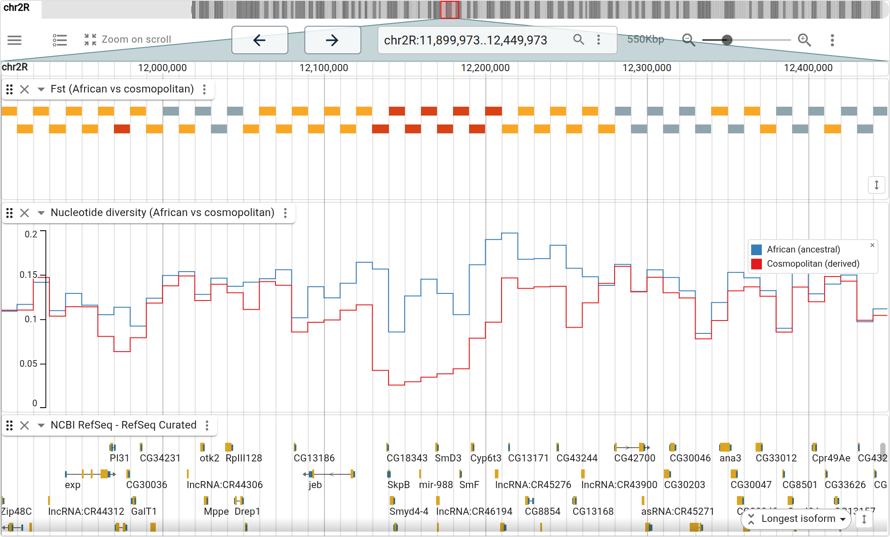
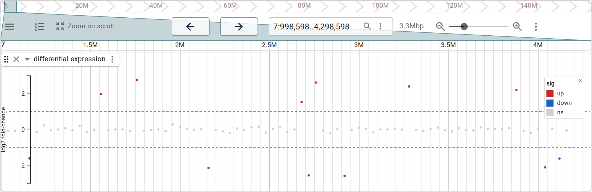
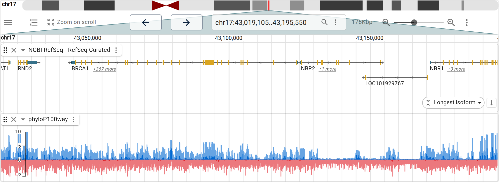
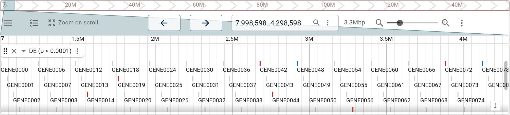
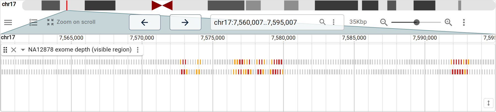
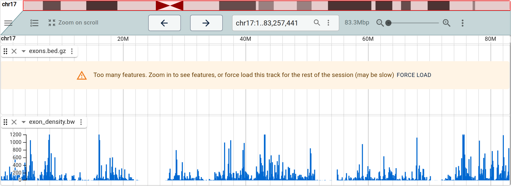
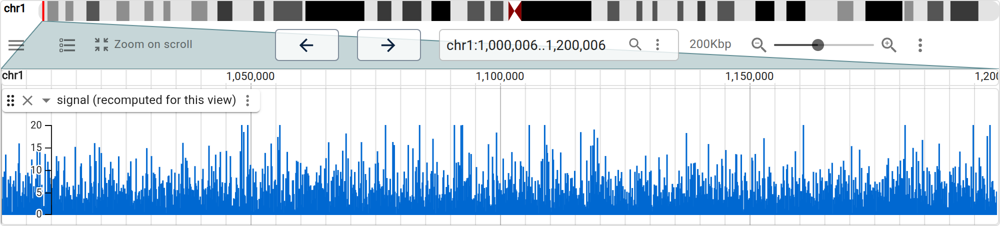

# jbrowse-anywidget

JBrowse 2 linear genome view as an [anywidget](https://anywidget.dev), drawn on
the GPU (WebGPU, with WebGL and Canvas2D fallbacks) with its data fetching and
parsing in a web worker. One bundle renders in Jupyter, JupyterLab, VS Code,
Colab, and marimo, with two-way sync of the visible region between Python and
the view.

This is the modern replacement for the Dash-based `jbrowse-jupyter` +
`dash_jbrowse` stack: no Dash server, no `dash-generate-components`, no webpack
— just a Vite-bundled ESM file loaded by anywidget.

## Install

```bash
pip install jbrowse-anywidget
```

The JS bundle ships prebuilt inside the wheel, so there is no Node toolchain to
set up. Until the first PyPI release, install from git:

```bash
pip install "jbrowse-anywidget @ git+https://github.com/GMOD/jbrowse-anywidget"
```

```python
from jbrowse_anywidget import LinearGenomeView

LinearGenomeView(assembly="hg38", location="chr1:1,000,000..1,100,000")
```

## What it looks like

Every figure below is a notebook that was **executed**.
`python scripts/run_examples.py` runs each `examples/*.ipynb` top-to-bottom in a
real kernel, reads the widgets off that kernel, and photographs them from the
built bundle — so a figure is what the notebook produces, not a description of
it kept alongside. The two with no notebook are marked.

A linear view with a conservation bigWig
([01](https://colab.research.google.com/github/GMOD/jbrowse-anywidget/blob/main/examples/01_quickstart.ipynb)):


A bioframe interval result dropped onto the genome — CpG islands as bars of GC%
up close and a count per zoom-following bin across the arm, from one mark
display, plus their shores
([02](https://colab.research.google.com/github/GMOD/jbrowse-anywidget/blob/main/examples/02_dataframe_analysis.ipynb)):


GPU-rendered CRAM alignments, from a hub assembly named by string
([03](https://colab.research.google.com/github/GMOD/jbrowse-anywidget/blob/main/examples/03_alignments.ipynb)):


Multi-sample structural variants, one row per sample, colored by cohort
([04](https://colab.research.google.com/github/GMOD/jbrowse-anywidget/blob/main/examples/04_multisample_variants.ipynb)):


### Run an analysis, load the result onto the genome

pysam read depth over _BRCA1_, binned, drawn as bars on a value axis with a
threshold colour scale
([05](https://colab.research.google.com/github/GMOD/jbrowse-anywidget/blob/main/examples/05_bam_coverage.ipynb)):



A windowed Fst scan between two _Drosophila_ populations, the sweep landing over
_Cyp6g1_: a bar per window on a value axis, coloured by a threshold scale, with
per-population diversity underneath
([06](https://colab.research.google.com/github/GMOD/jbrowse-anywidget/blob/main/examples/06_popgen_selection.ipynb)):



Differential expression as a plot on the genome: a point per gene at its log2
fold-change, coloured by call, the cutoffs drawn as rules
([07](https://colab.research.google.com/github/GMOD/jbrowse-anywidget/blob/main/examples/07_differential_expression.ipynb)):



### Data access, and the loop back to Python

A hosted assembly hub — sequence, aliases, cytobands, gene search — opened at a
gene by name
([08](https://colab.research.google.com/github/GMOD/jbrowse-anywidget/blob/main/examples/08_hosted_assembly_hub.ipynb)):



An `ipywidgets` slider reclassifying every gene in Python and repainting
([09](https://colab.research.google.com/github/GMOD/jbrowse-anywidget/blob/main/examples/09_interactive_controls.ipynb)):



Coverage recomputed in the kernel for the region in view, at a bin size that
follows the zoom
([10](https://colab.research.google.com/github/GMOD/jbrowse-anywidget/blob/main/examples/10_region_reactive.ipynb)):



### Comparing genomes

Four E. coli strains tied by one all-vs-all PAF, from `JBrowseApp`
([11](https://colab.research.google.com/github/GMOD/jbrowse-anywidget/blob/main/examples/11_synteny_ecoli.ipynb)):


The same alignment as a dotplot (no notebook — see 11's closing note):


### Scale

Every human RefSeq exon — 2.1M features — written to a tabix file in the kernel
and read by byte range, no server. Whole-chromosome, which is the notebook's
point about containers: the bigWig serves a summary from its zoom levels, while
the tabix track asks you to zoom in, because it has none
([12](https://colab.research.google.com/github/GMOD/jbrowse-anywidget/blob/main/examples/12_large_data.ipynb)):



A chromosome of signal, rebinned in Python for whatever is on screen
([13](https://colab.research.google.com/github/GMOD/jbrowse-anywidget/blob/main/examples/13_large_wiggle.ipynb)):



A GWAS track drawn as a Manhattan plot by its display has no notebook either; it
is under [Plots](#plots-gwas-manhattan-and-more), with the config that makes it.

## Try it in Colab

- Quickstart —
  [](https://colab.research.google.com/github/GMOD/jbrowse-anywidget/blob/main/examples/01_quickstart.ipynb)
- bioframe result → track (real CpG islands + shores) —
  [](https://colab.research.google.com/github/GMOD/jbrowse-anywidget/blob/main/examples/02_dataframe_analysis.ipynb)
- GPU alignments (BAM/CRAM) —
  [](https://colab.research.google.com/github/GMOD/jbrowse-anywidget/blob/main/examples/03_alignments.ipynb)
- Multi-sample variants —
  [](https://colab.research.google.com/github/GMOD/jbrowse-anywidget/blob/main/examples/04_multisample_variants.ipynb)
- Read depth from a BAM with pysam (NA12878 exome over BRCA1) —
  [](https://colab.research.google.com/github/GMOD/jbrowse-anywidget/blob/main/examples/05_bam_coverage.ipynb)
- Between-population selection scan (Fst) → view the sweep (Drosophila Cyp6g1,
  real DEST data) —
  [](https://colab.research.google.com/github/GMOD/jbrowse-anywidget/blob/main/examples/06_popgen_selection.ipynb)
- Differential expression → view —
  [](https://colab.research.google.com/github/GMOD/jbrowse-anywidget/blob/main/examples/07_differential_expression.ipynb)
- Easy human data (hosted assembly hub) —
  [](https://colab.research.google.com/github/GMOD/jbrowse-anywidget/blob/main/examples/08_hosted_assembly_hub.ipynb)
- Interactive controls — a slider that re-runs the analysis —
  [](https://colab.research.google.com/github/GMOD/jbrowse-anywidget/blob/main/examples/09_interactive_controls.ipynb)
- Region-reactive — recompute only what's on screen as you pan —
  [](https://colab.research.google.com/github/GMOD/jbrowse-anywidget/blob/main/examples/10_region_reactive.ipynb)
- Compare genomes — four E. coli strains in a linear synteny view —
  [](https://colab.research.google.com/github/GMOD/jbrowse-anywidget/blob/main/examples/11_synteny_ecoli.ipynb)

05–07 are the core loop — **run an analysis in Python, load the result onto the
genome** — using the tools scientists already reach for (pysam, bioframe,
scipy/statsmodels) on real data. 09–10 close the loop the other way: a widget
control or a pan in the view drives Python to **recompute and repaint**, live.

## Develop

The JS bundle links the GPU-rendered `@jbrowse/react-linear-genome-view2` (v4)
directly from a sibling `jbrowse-components` checkout so it tracks the latest
work — see the `link:` dependency in `package.json`. Clone that repo next to
this one:

```bash
git clone https://github.com/GMOD/jbrowse-components ../jbrowse-components
pnpm install        # resolves the link: dependency to ../jbrowse-components
pnpm build          # writes static/index.js (lgv) and static/app.js (full app)
pip install -e ".[dev]"
```

`pnpm dev` rebuilds the bundle on change, and `pnpm typecheck` runs tsc. Then
open a notebook from `examples/`. `pytest` covers the DataFrame and local-file
paths, the Python <-> JS trait contract, and every README and notebook snippet
against the linked products' option interfaces; neither it nor the bundle build
needs network. `ruff check` and `ruff format` lint the Python, `pnpm format`
runs prettier over everything else (all three run in CI); the generated
notebooks and the built bundle are excluded from both.

The notebooks and the figures need the extra script dependencies
(`pip install -e ".[dev,scripts]"`), which are what the notebooks themselves
import — `run_examples.py` executes them for real:

```bash
python scripts/build_examples.py    # rewrite examples/*.ipynb from the generator
python scripts/run_examples.py      # run every notebook, then photograph what
                                    #   each one built -> images/*.png
python scripts/run_examples.py 03   # just notebook 03, while iterating
```

The whole corpus executes in about 90 seconds — every notebook is network bound
rather than compute bound — so running them is cheap enough to do on every
change. It is also the only check that they run at all: `pytest` never opens
one, so a cell that raises is invisible until a reader hits it in Colab.
Rendering the figures is the slow half, at roughly half a minute each.

Both need puppeteer, which resolves from the sibling `jbrowse-components`
checkout.

## API

A widget's options are the JBrowse product's own, passed through verbatim with
JBrowse's camelCase keys: `LinearGenomeView(**options)` takes
[`createLinearGenomeView`](https://github.com/GMOD/jbrowse-components/blob/main/products/jbrowse-react-linear-genome-view/src/createLinearGenomeView.ts)'s
options and `JBrowseApp(**options)` takes
[`createApp`](https://github.com/GMOD/jbrowse-components/blob/main/products/jbrowse-react-app/src/createViewStateFromProps.ts)'s.
This package names none of them, so an option JBrowse adds works here unchanged.

```python
from jbrowse_anywidget import LinearGenomeView, features_track

view = LinearGenomeView(
    assembly="hg38",
    location="10:29,838,565..29,838,850",
    tracks=[
        "https://.../ncbiRefSeq.sort.gff.gz",
        {"uri": "https://.../reads.cram", "name": "Tumor"},
    ],
)
view                                   # display
view.update(location="BRCA1")          # merge keys into view.options
view.update(tracks=[*view.options["tracks"], features_track(df, name="peaks")])
view.location                          # read back the user's current region
```

`update` merges its keywords into `view.options`, and the view applies the keys
that changed: a linear view's `tracks` and `location` in place, an app's
`session` in place, anything else by rebuilding. `location`, `view_locations`
(`JBrowseApp`), `current_session` and `selected_feature` are read-backs the view
writes, separate from the options so live state never overwrites what you asked
for.

`assembly` takes a hub name (`"hg38"`, a GenArk `GCF_...`), a sequence-file URL,
or an assembly config. A `tracks` entry is a bare data-file URL, a
`{"uri", "index"?, ...}` dict, or a full JBrowse track config; the view infers
the track type and adapter from the extension with JBrowse's own format plugins.
`assemblyNames` is filled from the view's assembly.

Python adds only what JSON cannot express:

- `features_track(df, name=, color=, ...)` turns a DataFrame or a list of dicts
  into a track config, inlining the rows. A `score` column makes it a wiggle,
  and any other keyword is track config merged on top, so `displays=` plots the
  columns ([Plots](#plots-gwas-manhattan-and-more)).
- `view.add_local_file(path)` pushes a file from this kernel into the browser,
  where it is read by byte range, and returns the name to use as its URL.
- `fetch_hub("hg38")` fetches a hosted config (a UCSC name, a GenArk accession,
  or any config.json URL) with its relative URIs stamped to resolve.

## Theme, and the rest of the root config

The `configuration` option is JBrowse's root configuration block — the same one
a `config.json` carries, so `theme`, `preferences`, `rpc` and `formatDetails`
are all reachable without a Python name per slot. A notebook in a dark
JupyterLab wants the first one:

```python
LinearGenomeView(
    assembly="hg38",
    configuration={"theme": {"palette": {"mode": "dark"}}},
)
```

JBrowse drops a slot it does not recognise without a word, so a misspelling here
is a setting that silently never applies — the slot names are in the
[config guide](https://jbrowse.org/jb2/docs/config_guide/).

## Saving a layout

`view.current_session` is the arrangement the user has built — open tracks,
where each is looking, per-display settings — as the plain JSON the `session`
option takes, so a layout round-trips:

```python
saved = view.current_session          # after arranging it by hand
LinearGenomeView(assembly="hg38", session=saved)
```

`fetch_hub("hg38")` returns a hosted config from genomes.jbrowse.org — sequence,
refName aliases, cytobands, a gene-name search index and a catalog of hosted
tracks — as plain JSON to pick from. See
`examples/08_hosted_assembly_hub.ipynb`.

## Plots (GWAS Manhattan, and more)

A track's _display_ can plot its data — a
[`GWASTrack`](https://jbrowse.org/jb2/docs/config/gwasadapter/) with a
[`LinearManhattanDisplay`](https://jbrowse.org/jb2/docs/config/linearmanhattandisplay/)
renders genome-wide summary statistics as a Manhattan plot right in the linear
view. The plot is just a `displays` block on the track config, so it needs no
special widget. The adapter's `uri` shorthand finds the `.tbi` index for you,
and JBrowse fills in `displayId`:

```python
LinearGenomeView(
    assembly="hg19",
    location="2",
    tracks=[{
        "type": "GWASTrack",
        "trackId": "gwas_track",
        "name": "GWAS",
        "adapter": {
            "type": "GWASAdapter",
            "scoreColumn": "neg_log_pvalue",
            "uri": ".../summary_stats.txt.gz",
        },
        "displays": [{"type": "LinearManhattanDisplay", "height": 250}],
    }],
)
```


A DataFrame's columns plot the same way. `LinearMarkDisplay` is JBrowse's
grammar of graphics, in the sense of Vega-Lite or ggplot: `marks` lists a `bar`,
`point` or `span` per entry, each `encoding` maps a column to a channel, a
`scale` is `categorical`, `linear`, `log` or `threshold`, and `scales.y` carries
the axis title and reference rules. The legend and axis follow from the
encoding, so there is no colour expression to write. Think
`aes(y = log2fc, colour = sig)`:

```python
features_track(
    de,
    name="differential expression",
    displays=[{
        "type": "LinearMarkDisplay",
        "scales": {"y": {"title": "log2 fold-change", "rules": [1, -1]}},
        "marks": [{
            "shape": "point",
            "encoding": {
                "y": "log2fc",
                "color": {
                    "field": "sig", "scale": "categorical",
                    "domain": ["up", "down", "ns"],
                    "range": ["#c62828", "#1565c0", "#cfcfcf"],
                },
            },
        }],
    }],
)
```

Notebooks 06, 07 and 09 draw their results this way, and a `transform` list
(`bin`, `aggregate`, `coverage`, `pileup`) can summarize the rows before the
encoding; the
[mark display guide](https://jbrowse.org/jb2/docs/config_guides/mark_display/)
has the whole grammar.

JBrowse's [config guide](https://jbrowse.org/jb2/docs/config_guide/) and the
per-type [config docs](https://jbrowse.org/jb2/docs/config/) cover the other
display-driven plots (Manhattan/LD, Hi-C matrices, multi-wiggle, sashimi) — each
is a track config plus a `displays` choice.

## Comparing genomes (synteny, dotplots)

`LinearGenomeView` is one linear view. For comparative genomics, `JBrowseApp`
drives the full app from a declarative `views=[...]` list — each entry a
`{"type", ...settings}` dict with every setting written beside `type`, the same
object a config.json `defaultSession.views` entry and JBrowse Web's
[`?session=spec-…` URLs](https://jbrowse.org/jb2/docs/urlparams/) hold. The
settings come from the view's
[state-model docs](https://jbrowse.org/jb2/docs/models/linearsyntenyview/):

```python
from jbrowse_anywidget import JBrowseApp

JBrowseApp(
    assemblies=[
        {"name": "hg38", "uri": hg38_fa},
        {"name": "mm39", "uri": mm39_fa},
    ],
    tracks=[
        {
            "type": "SyntenyTrack",
            "trackId": "hg38_mm39",
            "name": "hg38 vs mm39",
            "assemblyNames": ["hg38", "mm39"],
            "adapter": {
                "type": "PAFAdapter",
                "targetAssembly": "hg38",
                "queryAssembly": "mm39",
                "uri": "hg38_mm39.paf",
            },
        }
    ],
    views=[
        {
            "type": "LinearSyntenyView",
            # a comparative view's panels are {"assembly", "loc"?} per side
            "views": [{"assembly": "hg38"}, {"assembly": "mm39"}],
            "tracks": ["hg38_mm39"],
        }
    ],
)
```

This is the JBrowse vocabulary, so it transfers unchanged to a `config.json`, to
the state-model docs, and to a `?session=spec-…` URL. Change `"type"` to
`"DotplotView"` for the same alignment as a dotplot.

It loads a separate, larger bundle (the full app), so the single-view
`LinearGenomeView` stays lean.

## Publishing (to make the Colab links live)

The built JS bundle in `jbrowse_anywidget/static/` is committed, so the package
installs with no JS toolchain:

```bash
pnpm build                       # refresh the bundle after any src/ change
python -m build                  # sdist + wheel (includes static/)
twine upload dist/*              # -> PyPI, so `pip install jbrowse-anywidget` works
```

Then push to `github.com/GMOD/jbrowse-anywidget` and the Colab badges resolve.
Colab renders the widget because each notebook enables the custom widget manager
(`output.enable_custom_widget_manager()`).

## Status

Prototype, bundling the GPU-rendered v4 view. 0.3.0 replaced the per-option
constructor parameters, setters and `add_track`/`add_features`/`plugin` with the
pass-through options and `update` above. All thirteen notebooks in `examples/`
are executed nightly, top-to-bottom, in a real kernel, and every figure in this
README is photographed from the widget one of them built — so "runs in Colab" is
a checked claim rather than a hopeful one. Their analyses use the tools
scientists already work in (bioframe intervals, pysam coverage,
scipy/statsmodels DE, DEST Fst windows) on real data. Two of them close the loop
the other way — a slider and a pan in the view drive Python to recompute and
repaint.

Synteny and dotplot views ship today via `JBrowseApp` (see above), and
[JBrowseR](https://github.com/GMOD/JBrowseR) wraps the same bundle for R. Next:
a binary fast-path for large feature sets.
